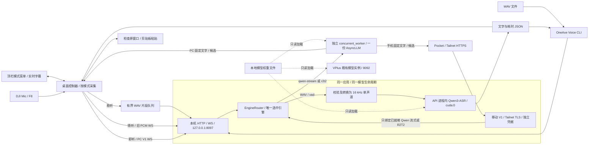

# 架构与隔离边界

先看 [离线架构与流程图](architecture-map.html)，可按总体、听写、并发、生命周期和部署边界展开。

第一阶段提供 GPU 短录音 API；第二阶段增加 DJI Mic、F8 和 X11 粘贴；第三阶段在独立桌面控制器中增加 CPU WebRTC VAD、持续采集及串行分段队列。第四阶段加入两种官方流式引擎、独立工作进程及顶栏控制。算法及边界见 [VAD 说明](vad.md) 和 [三模式说明](modes.md)。

流式桌面端持续发送语音 PCM，约 1 秒停顿后在同一队列发送 `flush`，工作进程按官方尾部算法执行推理并重建当前句状态，保留全局文字和热模型。候选、模型固定、已发送/复制三个状态分别保存，字幕不再把候选冒充已输入。停顿后的空闲静音在桌面过滤，WS 通过保活维持整轮租约。

结果沿原 HTTP / WS 连接返回。三种 Voice 引擎互斥驻留；Qwen 流式与 R2T2 均支持 1 路 PC + 1 路远端，远端名额由手机和 Linux 客户端共用。远端统一查询 capabilities、通过移动 V1 绑定已就绪模型，不能选择或加载引擎；`vad` 不支持远端。Qwen 新增 V1 与并发能力的实际验收状态见 [验证记录](validation.md)。

## 与 VPlus 的关系

| 项目 | OneAxe Voice | VPlus |
| --- | --- | --- |
| 代码 | `~/tools/oneaxe-voice` | `~/tools/oneaxe.cn/apps/vplusASRMasterLu` |
| Python 环境 | 本项目 `.venv` / `.venv-stream` | `~/tools/miniconda3/envs/qwen3-asr` |
| 用户级服务 | `oneaxe-voice.service` | `oneaxe-vplus.service` |
| HTTP 端口 | `127.0.0.1:8097` | `8092` |
| 模型实例 | 桌面启动/选择时预热，独立生命周期 | 由既有服务管理 |
| 模型权重 | 默认读取 `~/tools/models/Qwen3-ASR-1.7B` | 使用既有本地权重 |

上述目录是旧机器的布局记录。新安装默认从当前用户 home 目录解析模型位置；可通过 `ONEAXE_VOICE_MODEL_DIR` 指向其他本地权重目录。

本项目不导入 VPlus 代码、不提交 VPlus 任务、不访问其任务数据库，不管理其服务。环境由已有可用环境克隆到独立目录，以避免再次下载依赖；后续依赖操作只针对本项目 `.venv`，不要直接编辑两个环境的包文件。模型通过 `local_files_only=True` 加载，服务设置离线变量，运行无需下载模型或配置外网代理。

独立实例仍共享同一张 RTX 4090 的算力、显存和显存带宽。代码与进程隔离不能保证 VPlus 在同时重负载时完全不受性能影响。当前未做并行课程转写负载测试，也没有跨服务的 GPU 优先级调度。将来若需要统一调度，可另行设计公共推理服务及 VPlus 迁移；本阶段没有进行该迁移。

## GPU 与并发

以下 PyTorch 分配限制适用于稳听。Qwen 流式默认保留 512 MiB KV 缓存；R2T2 默认使用 1 GiB KV。两者均由 `concurrent_worker` 加载一份 AsyncLLM，默认 `max_num_seqs=2`，CUDA decode graph 的 capture sizes 为 `[1, 2]`；权重与编码器另占显存。启动要求至少 7 GiB 空闲，不设整个进程的显存硬上限。引擎路由同时只保留一个 OneAxe 模型；切换前释放旧实例。

Qwen 流式与 R2T2 各自使用一个 AsyncLLM 共享权重，各会话有独立音频窗口、文本前缀、输入队列和取消标识。每路最多一个模型步骤在途，两个会话可同时提交，由 vLLM 连续批处理。Qwen 的 `qwen_async.py` 保留官方 2 秒块、前 2 块整体修订、之后回退 5 token，额外保留 8 token 作为固定边界；普通步与尾部步均最多生成 256 token，连续窗口到 30 秒收尾后重建。R2T2 普通步仍遵循官方首次 320 ms / 4 token、随后 160 ms / 2 token，窗口 16 秒、移动 8 秒，句尾最多 64 token；不直接把未稳定 token 粘贴出去。R2T2 细节及官方固定源码版本见 [并发研究](concurrency-research-2026-10-02.md)。

PC 保留整轮管理保护；远端不占 PC 的整轮锁，而是原子绑定已就绪 Qwen 流式或 R2T2 的服务实例和模型代次。生命周期锁仅登记和核对状态，不等待 GPU RPC。`busy` 表示任一会话占用，`pc_busy` 表示是否受 PC 管理保护。远端单独活动时，PC 主动切换/卸载可以结束远端；PC 正在录音时管理操作返回 429。正常结束、取消和断线不关闭共享 worker；引擎全局故障才结束受影响的全部会话。

本机 V1 `start` 仍传入 `mode`，现接受 `qwen-stream` 与 `r2t2`；Qwen F8 保留旧 WS 的逐包请求/响应流程。远端固定使用移动 V1 路径，`start` 不传 `mode`，由 capabilities 与实际 `ready` / `flow` 给出额度。R2T2 默认窗口为 32000 样本；Qwen 窗口为 `max(configured_window, 32000 + max_frame_bytes / 2)`，默认 34560 样本，确保 2560 样本整帧可以跨过 2 秒推理边界。`audio_processed_samples` 仅累计真实已处理 PCM，数字静音也计数；未推理缓冲与附加的 80 ms 尾部上下文不计入，flush 不清零。

两种流式 worker 继续使用 4 个 CPU 线程与仅对子进程生效的 `OMP_WAIT_POLICY=PASSIVE`；音频特征由 CPU 处理，模型由 GPU 推理。

- 固定 CUDA 推理，加载后检查全部参数位于指定设备。CUDA 不可用时返回 `503`，不切换 CPU。
- FP16。稳听只支持本机片段识别；Qwen 流式和 R2T2 支持 1 PC + 1 远端，同时为 PC 保留一个名额。状态查询和策略修改仍可使用；桌面稳听自己的有界队列仍串行消费片段。
- 默认 PyTorch 分配上限为显卡总量的 25%，本机约 6012 MiB。它约束 PyTorch 的分配器，不是整个进程的 GPU 占用硬上限；CUDA 上下文及其他库的显存可能不在其中。
- 加载前检查空闲显存不少于 5 GiB；检查与实际分配之间仍可能有其他进程竞争。显存不足会报错，独立服务不会清理其他进程。
- 默认常驻模型。顶栏可立即卸载，或勾选空闲 120 秒后自动卸载（检查周期 5 秒）；策略保存在私有 `runtime/model-policy.json`。全部会话都结束后才开始空闲计时，状态查询不刷新计时。手动卸载后轮询不会重载；只有 PC 的模式选择、立即加载、F8 或本机识别可以加载模型，移动端不能隐式加载。
- 卸载同时清理本进程的 cuBLAS 工作区。本机 PyTorch 2.10 在线程间推理时，小工作区可能让分配器的大块显存无法归还；只删除权重并调用 `empty_cache()` 不充分。当前使用该版本的 `_cuda_clearCublasWorkspaces` 内部接口，升级 PyTorch 后须重新验证释放行为；若接口缺失会记录警告。CUDA 上下文仍可保留数百 MiB，停止服务才会全部释放。
- systemd `Nice=5` 只降低 CPU 调度优先级，不提供 GPU 优先级保障。

## 音频与结果

接受 0.1–60 秒、8000–48000 Hz、单/双声道、16-bit PCM WAV；音频文件最大 12 MiB。ffmpeg 将有效输入转为 16 kHz 单声道，模型按中文识别。`max_new_tokens=512` 限制单次生成，较长或语速很快的输入可能截断文字；本阶段实际验证了 10 秒样本，未承诺 60 秒录音的完整性或准确率。

全零 PCM 数字静音直接返回空文字，无需加载模型。这不是 VAD；麦克风底噪和无意义声音仍可能触发识别。

默认客户端向 stdout 输出文字，耗时信息写 stderr；`--json` 返回完整信息，`--output` 可保存 UTF-8 文字。桌面控制器负责录音及自动粘贴，其生命周期、窗口保护和配置见 [桌面听写说明](desktop.md)。

## 本机访问与数据生命周期

本机管理 API 监听 loopback，须携带项目专用 Bearer token。`runtime/client.token` 权限为 `0600`，父目录为 `0700`。CLI 禁用环境代理并拒绝向非本机地址发送该令牌。

可选 Tailnet TLS 监听器与本机监听器共用同一个 ASGI app、一次 lifespan 和一个 EngineRouter。授权按实际监听 socket 区分，禁用代理头：Tailnet 只开放 `/api/mobile/v1/`，本机管理与旧识别不能从此入口访问。设备令牌独立、仅存摘要，吊销或轮换同时结束该设备会话。此版本是个人双端听写，尚未提供通用多租户服务。

请求体大小在 multipart 解析前检查，包括没有 Content-Length 的上传。服务把校验后的临时录音放在 `runtime/tmp/`，请求处理结束时删除；客户端断开后，已开始的后台推理仍会完成，防止使用中的文件被提前删除。正常日志记录请求 ID、设备和耗时，不记录完整转写文字或原始音频。强制终止进程可能留下临时文件，可在服务停止后手工清理该目录。
