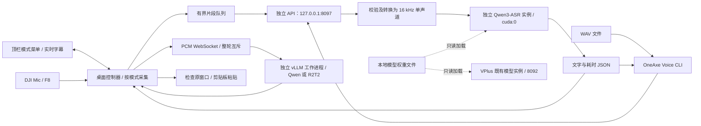

# 架构与隔离边界

第一阶段提供 GPU 短录音 API；第二阶段增加 DJI Mic、F8 和 X11 粘贴；第三阶段在独立桌面控制器中增加 CPU WebRTC VAD、持续采集及串行分段队列。第四阶段加入两种官方流式引擎、独立工作进程及顶栏控制。算法及边界见 [VAD 说明](vad.md) 和 [三模式说明](modes.md)。

## 与 VPlus 的关系

| 项目 | OneAxe Voice | VPlus |
| --- | --- | --- |
| 代码 | `~/tools/oneaxe-voice` | `~/tools/oneaxe.cn/apps/vplusASRMasterLu` |
| Python 环境 | 本项目 `.venv` / `.venv-stream` | `~/tools/miniconda3/envs/qwen3-asr` |
| 用户级服务 | `oneaxe-voice.service` | `oneaxe-vplus.service` |
| HTTP 端口 | `127.0.0.1:8097` | `8092` |
| 模型实例 | 首次请求加载，独立生命周期 | 由既有服务管理 |
| 模型权重 | 默认读取 `~/tools/models/Qwen3-ASR-1.7B` | 使用既有本地权重 |

上述目录是旧机器的布局记录。新安装默认从当前用户 home 目录解析模型位置；可通过 `ONEAXE_VOICE_MODEL_DIR` 指向其他本地权重目录。

本项目不导入 VPlus 代码、不提交 VPlus 任务、不访问其任务数据库，不管理其服务。环境由已有可用环境克隆到独立目录，以避免再次下载依赖；后续依赖操作只针对本项目 `.venv`，不要直接编辑两个环境的包文件。模型通过 `local_files_only=True` 加载，服务设置离线变量，运行无需下载模型或配置外网代理。

独立实例仍共享同一张 RTX 4090 的算力、显存和显存带宽。代码与进程隔离不能保证 VPlus 在同时重负载时完全不受性能影响。当前未做并行课程转写负载测试，也没有跨服务的 GPU 优先级调度。将来若需要统一调度，可另行设计公共推理服务及 VPlus 迁移；本阶段没有进行该迁移。

## GPU 与并发

以下 PyTorch 分配限制适用于稳听。流式模式固定 512 MiB KV 缓存，权重和编码器另占显存；启动要求至少 7 GiB 空闲，不设总显存硬上限。详见 [生命周期](modes.md#生命周期与数据)。引擎路由同一时间只保留一个 OneAxe 模型；切换前释放旧实例，流式整轮持锁，取消会回收工作进程及 CUDA 子进程。

- 固定 CUDA 推理，加载后检查全部参数位于指定设备。CUDA 不可用时返回 `503`，不切换 CPU。
- FP16、单次推理、batch size 1。第二个并发 API 请求立即收到 `429`；桌面控制器自己的有界队列串行消费片段。预热也使用同一互斥锁和模型实例。
- 默认 PyTorch 分配上限为显卡总量的 25%，本机约 6012 MiB。它约束 PyTorch 的分配器，不是整个进程的 GPU 占用硬上限；CUDA 上下文及其他库的显存可能不在其中。
- 加载前检查空闲显存不少于 5 GiB；检查与实际分配之间仍可能有其他进程竞争。显存不足会报错，独立服务不会清理其他进程。
- 默认空闲 120 秒后卸载，检查周期 5 秒；推理时持有互斥锁，卸载不能打断推理。再次请求需要重新加载模型。
- 卸载同时清理本进程的 cuBLAS 工作区。本机 PyTorch 2.10 在线程间推理时，小工作区可能让分配器的大块显存无法归还；只删除权重并调用 `empty_cache()` 不充分。当前使用该版本的 `_cuda_clearCublasWorkspaces` 内部接口，升级 PyTorch 后须重新验证释放行为；若接口缺失会记录警告。CUDA 上下文仍可保留数百 MiB，停止服务才会全部释放。
- systemd `Nice=5` 只降低 CPU 调度优先级，不提供 GPU 优先级保障。

## 音频与结果

接受 0.1–60 秒、8000–48000 Hz、单/双声道、16-bit PCM WAV；音频文件最大 12 MiB。ffmpeg 将有效输入转为 16 kHz 单声道，模型按中文识别。`max_new_tokens=512` 限制单次生成，较长或语速很快的输入可能截断文字；本阶段实际验证了 10 秒样本，未承诺 60 秒录音的完整性或准确率。

全零 PCM 数字静音直接返回空文字，无需加载模型。这不是 VAD；麦克风底噪和无意义声音仍可能触发识别。

默认客户端向 stdout 输出文字，耗时信息写 stderr；`--json` 返回完整信息，`--output` 可保存 UTF-8 文字。桌面控制器负责录音及自动粘贴，其生命周期、窗口保护和配置见 [桌面听写说明](desktop.md)。

## 本机访问与数据生命周期

API 仅监听 loopback，转写和状态接口须携带项目专用 Bearer token。`runtime/client.token` 权限为 `0600`，父目录为 `0700`。CLI 禁用环境代理并拒绝向非本机地址发送令牌。

请求体大小在 multipart 解析前检查，包括没有 Content-Length 的上传。服务把校验后的临时录音放在 `runtime/tmp/`，请求处理结束时删除；客户端断开后，已开始的后台推理仍会完成，防止使用中的文件被提前删除。正常日志记录请求 ID、设备和耗时，不记录完整转写文字或原始音频。强制终止进程可能留下临时文件，可在服务停止后手工清理该目录。
