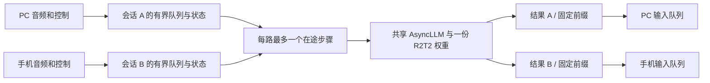

# R2T2 双端并发技术研究

日期：2026-10-02。下文保留实现前的源码研究与技术路线依据；该路线现已实现，实际性能与验收以 [验证记录](validation.md) 为准。接口以 [移动 V1](mobile-api-v1.md) 为准。

## 已确认目标

- 并发是必须实现的目标：PC 和手机持续输入时，各自持续收到文字，不能等待另一端整轮结束。
- 第一批验收 R2T2；其他模式未支持时明确报错，不替手机切换模型。
- PC 独占模型管理权。手机只使用实际已就绪的模型；取消、断线和超时只结束自己的会话。
- PC 主动切换或卸载时，可结束手机会话；手机保留已确认文字并提示原因。
- 移动入口采用 Tailnet DNS 名和 HTTPS/WSS。用户已授权由 Voice 负责人定稿，认证、消息及重连规则见 [移动接口 V1](mobile-api-v1.md)，无需逐项征求 Pocket 同意。

本轮读取了实际源码、固定版本官方资料及既有性能指标。只读状态显示 PC 正在 R2T2 听写，因此没有启动第二份模型、压测 GPU、重启服务或修改 VPlus。此文是研究产物，不能作为双端能力已上线的证明。

## 结论与路线选择

推荐 **一份模型 + 每会话独立 ASR 状态 + vLLM AsyncLLM 连续批处理**。

先将官方 R2T2 的单步逻辑拆成准备输入和提交结果，中间由异步引擎执行推理。每个会话最多一个在途推理步骤；同一会话必须按顺序推进，不同会话可以同时在引擎中执行。一个步骤完成后即可提交该会话下一步，无需等待另一会话收尾。

| 路线 | 研究判断 | 用途 |
| --- | --- | --- |
| 多个线程调用现有同步 wrapper | 没有线程安全保证；单 decoder 和 IPC 还会串状态 | 不采用 |
| 每路独立状态，短步串行轮转 | 可实现逻辑隔离；历史吞吐不足以证明双路实时 | 作为对照，不作为最终完成条件 |
| `LLM.generate([PC步, 手机步])` | 支持多输入和各自采样参数；整个调用等全部请求结束，长收尾会挡住短请求交付 | 作为批处理正确性与吞吐对照 |
| `AsyncLLM` 独立请求、连续批处理 | 有请求 ID、独立完成和按请求取消能力；最贴合持续双路与取消隔离 | 推荐实施主线，须验证模型注册和实测性能 |
| 两份模型 / 多个 API worker | 重复权重和引擎资源，仍竞争同一 GPU；不能自动解决吞吐 | 不作为默认方案 |

这里的 ASR 流式是随音频推进识别状态；vLLM 的 token 流式只是一次生成内的中间结果。不能把 token delta 直接作为可粘贴文字。

## 官方依据和固定版本

- R2T2：固定 [`26d55a54ce5670cff9947a167d8ed95d569fd4d9`](https://github.com/netease-youdao/Confucius4-R2T2/tree/26d55a54ce5670cff9947a167d8ed95d569fd4d9)，本地来源见 [vendor/README.md](../vendor/README.md)。
- 本机已安装 `qwen-asr==0.0.6`、`vllm==0.14.0`。vLLM 判断依据为本机安装包的官方源码；在线获取未成功，以下 GitHub tag 链接作为固定版本参考。本轮未升级依赖。
- R2T2 官方 `streaming_transcribe_no_reset` 明确注明单流、无批处理；可变音频、窗口和文字记录保存在传入的 `ASRStreamingState`。
- vLLM 0.14.0 [`LLM.generate`](https://github.com/vllm-project/vllm/blob/v0.14.0/vllm/entrypoints/llm.py) 支持 prompt 列表和逐项 `SamplingParams`，但同步等待整批完成。
- vLLM 0.14.0 [`AsyncLLM.generate` / `abort`](https://github.com/vllm-project/vllm/blob/v0.14.0/vllm/v1/engine/async_llm.py) 分别支持独立请求输出和按请求 ID 取消。异步接口存在不等于当前 ASR wrapper 已兼容。
- 官方 [WebSocket 示例](https://github.com/netease-youdao/Confucius4-R2T2/blob/26d55a54ce5670cff9947a167d8ed95d569fd4d9/ws_server.py) 接收和处理采用协程队列，但仍同步调用推理；源码还因同步阻塞关闭 WS ping。其“多客户端”说明不能替代本机双路持续识别证据。

## 算法如何拆分

以 [官方适配器](../vendor/r2t2/r2t2_asr.py) 为基线：

| 步骤 | 普通流式步骤 | 句尾收尾 |
| --- | --- | --- |
| 准备输入 | 628–683 行：格式转换、消费当前块、滚动窗口、生成 prompt 与音频输入 | 807–848 行：检查并加入尾部、滚动窗口、生成输入 |
| GPU 调用 | 684–693 行：`generate` 和结果提取 | 850–859 行：最终生成 |
| 提交结果 | 695–760 行：语言/标点处理、回滚、固定前缀与窗口文字更新 | 861–875 行：最终文字更新 |

保留首次 320 ms、后续 160 ms、16 秒窗口及 8 秒移动的既有语义；普通步骤仍使用当前 4/2 token 上限，收尾保留 64 token 上限。先验证调度，避免同时改变识别算法而混淆质量和性能变化。

准备普通步骤时每次只消费一块，不照搬原函数的 `while` 一次排空整包。窗口严格在超过 16 秒时移动 8 秒，首次对应丢弃 49 块文字记录，之后为 50 块；每路独立保存首次移动标记。

收尾还必须保留 [现有 StreamDecoder](../oneaxe_voice/stream_worker.py) 的封装：待处理尾部 PCM 加 1280 样本（80 ms）静音、无有效音频门控，以及固定全文前缀校验。否则恰好整块结束时，官方函数遇空 buffer 会跳过推理，造成尾词丢失。`flush` 才重建句状态、恢复首次 320 ms 并保留全局全文；`finish` 不重建。

普通结果提交与最终结果提交保持两条路径。普通步骤包含标点决定的 token 回退、乱码边界保护和固定增量计算；final 不执行同一回退规则，但仍须检查新全文以已提交全文开头。

具体规则：

1. 每路保存自己的 PCM 队列、`ASRStreamingState`、固定全文、候选、步骤编号和生命周期状态。
2. 准备当前步骤时生成不可混淆的步骤上下文；本路推理返回前，不准备本路下一步。后一段 prompt 依赖前一段识别结果。
3. 为就绪会话分别提交异步请求，请求 ID 关联服务实例、模型代次、会话、句代次和步骤；重建句状态后不接受旧句结果。
4. 使用 `RequestOutputKind.FINAL_ONLY` 取得单步完整生成结果后，执行官方的结果提交逻辑，再发布固定文字。其他会话可继续执行自己的步骤；这不是等待整轮录音结束。
5. `flush` 是本路的顺序屏障：前面的音频完成后收尾、重置本路句状态，再处理后续音频。`finish` 收尾后关闭本路。它们都不是全局屏障。
6. 取消先将会话标记为不可提交，再取消其在途请求并清理队列；任何迟到结果都核对会话、代次和步骤后丢弃。

本轮 AST 检查确认两个官方方法直接赋值的识别字段属于 `state`，未发现对 `self` 属性的直接赋值。这支持拆分状态的判断；不证明 tokenizer、底层引擎线程安全，也不证明 GPU 输出等价。

另完成纯 CPU、内存中的隔离演算：提取固定版本的初始化、流式和收尾函数及解析函数，用 NumPy、模拟字符 tokenizer 和模拟推理返回，比较 A 路 220 步 / B 路 197 步各自串行执行与双路交错执行。跨越多次窗口移动后，各状态字段一致，最大音频窗口 16 秒，两端不共享状态数组；收尾后步骤计数为 221 / 198。未导入 torch/vLLM。该结果证明这些官方函数在模拟条件下可维护独立状态，不是拆分实现、真实 tokenizer、真实批推理或双路 GPU 的验收。

不通过临时替换共享 `model.generate` 来拦截调用，不从多个线程同时驱动现有 `LLM`。建议新增有来源说明的适配模块，保留固定的官方文件作为对照，并复用能够安全复用的状态定义和解析函数。

每个请求携带自己的一个音频窗口。已安装 Qwen/vLLM 后端按各项音频长度分割特征及 embedding，具备变长音频合批的实现基础；不要把 PC 与手机波形拼成一条音频。实际能否同批执行仍受编码器和 token 预算影响，不保证线性加速。

## 服务与客户端也要一起改

- `EngineRouter`：把整轮 `gate`、单个 `active_stream` 改为会话表与模型代次租约。手机绑定已就绪模型不经过 `_select`；仍只允许一个实际模型代次。
- worker：从单 decoder 和同步问答改成按会话分发的请求/事件；IPC 带会话、请求和步骤标识，只有统一调度者驱动共享引擎。
- 服务端 WS：接收、调度和发送分离。不能在接收循环中等待一次 GPU 推理结束后才读取取消或新音频。
- PC 客户端：当前 `_consume_stream` 是发一包、等一包，再等待粘贴。应分离音频发送、结果接收和本地输入队列，保留目标窗口保护、顺序追加和停止后尾部补齐。
- 每端输入及输出都有容量限制。慢客户端只影响本端；候选可合并为最新快照，固定文字必须可完整恢复或明确报告失败，不能静默丢弃。
- 为 1 个 PC 和 1 个手机保留会话容量。公平推进每路，不让一端的大音频包或重复请求吞占所有调度机会。
- 自动卸载只在全部会话释放后计时。只有 PC 模型管理或全局故障恢复才可释放共享 worker，正常取消不得杀进程。

AsyncLLM 的输入预处理仍包含同步 CPU 工作，异步接口不会消除所有阻塞。控制接收须与它隔离，并测量预处理开销；未经验证不能把共享 processor 随意放进多个线程。引擎优先级也不等于可随时抢占正在执行的 GPU kernel。

R2T2 的模型架构是 `Qwen3ASRForConditionalGeneration`，依赖 qwen-asr 的 Transformers 和 vLLM 外部注册。官方 qwen-asr CLI 同样先注册再启动服务。新增 AsyncLLM 启动路径要提供可重入的注册入口：显式验证父进程、EngineCore 和 GPU worker 在 `spawn` 下均可解析架构，创建引擎放在主入口守卫内；必要时使用 vLLM 官方插件机制。不能仅凭父进程 `import` 成功就报告兼容，qwen-asr 的部分注册失败会被捕获。启动后还须验证真实音频和批量 1/2 的预热再报告就绪。

## 性能与资源判断

[既有验证](validation.md)中，65 秒样本的 R2T2 处理时间为 36.04 秒；这是特定样本和配置的历史吞吐，不是当前双流测试，也不是首字延迟。两路完全串行粗算 `2 × 36.04 / 65 ≈ 1.11`，提示不能靠排队就承诺持续实时。

两个持续输入会话在稳态各每 160 ms 需要一个步骤，即合计约 12.5 步/秒。双项批处理平均耗时低于 160 ms 是一种必要吞吐检查，还需为预处理、网络抖动和收尾留余量。异步路线则直接观测每路音频积压是否随时间增长，以及固定文字延迟。

共享模型不需要把权重复制两份，但会增加同时在途的 KV、音频编码激活、CUDA graph 和 CPU 状态。当前 `max_num_seqs=1`、固定 KV 512 MiB、graph capture `[1]` 都要重新评估；仅更改其中一个参数不构成并发实现。

本地 R2T2 文本配置为 28 层、8 个 KV heads、head dimension 128。现有单卡、未量化、FP16 条件下，依据本机 vLLM 缓存规格估算，每 token KV 为 `2 × 28 × 8 × 128 × 2 = 114688` 字节，即 112 KiB。两路都达到 4096 token 的理论 KV 为 896 MiB；4096 是配置上限，不是每个 160 ms 步骤的实际上下文长度。实际 token 数须包含多模态处理后的音频 token、文字和生成结果，不能只数文字 prompt。实际容量还需核对引擎缓存布局、block 舍入和额外资源，不能据此宣布显存预算已足够；512 MiB 与 1 GiB 可作为实测候选，而不是直接承诺值。

当前显存设置中的 `kv_cache_memory_bytes` 是显式 KV 预算，不能把 `gpu_memory_utilization=.30` 当整个进程显存硬上限。压测需要记录实际峰值与其他 GPU 应用负载，保留 VPlus 的运行边界。

## 实施后的验证顺序

以下为后续验证设计，本轮未执行 GPU 实验。

1. **CPU 算法等价与隔离**：同样的模拟模型返回序列，比较官方同步路径与拆分路径的状态/固定前缀；覆盖窗口移动、任意 PCM 拆包、短尾音、标点、重复 flush、取消和交错完成。模拟通过不能代表真实识别通过。
2. **单路真实回归**：同一测试音频比较原路径、拆分同步路径和异步路径，核对输出差异、稳定前缀、窗口与尾部，不把 batch 改变后的浮点差异自动认定为可接受。
3. **双路引擎对照**：比较短步串行、同步 batch=2、AsyncLLM。保持模型、音频和解码参数一致；覆盖错峰输入、不同窗口长度、一端收尾/另一端持续说话，以及批量 1/2 的预热。
4. **长时间持续双路**：两路已知且不同的测试语音实时送入至少 10 分钟，并增加跨越多个窗口的连续说话压力场景。分别测首候选、首固定文字、固定文字 p50/p95/p99、最大有效语音输出间隔、收尾延迟、积压趋势、GPU 峰值及预处理耗时。
5. **双端端到端**：真实 PC 与跨网络手机各自输入文字；分别取消、断网、慢接收、超限、PC 切换模型，验证另一端行为及既定权限规则。两边都持续出字、无串流、无重复误填，才满足目标。

先看正确性和积压趋势，再联合确认可接受的延迟阈值。最终测试应保留具体配置、版本、模型代次、会话 ID、受控测试结果及聚合指标，不记录访问凭据或私人听写内容。

当前 worker 的 `inference_ms` 不包含 IPC、服务端排队、网络和客户端输入耗时，且一次 `feed` 可能处理多个模型步骤。新指标要分开记录接收、入队、准备、推理提交/完成、固定文字事件及客户端收到/填入的时刻，避免用单项指标冒充端到端延迟。

若吞吐不达标，按测量结果依次检查批次形成、预处理、编码/prefill、KV 预占与 CUDA graph 覆盖。下一层再评估音频步长、窗口和缓存优化；这些会改变延迟或识别语义，需要独立质量回归。官方滚动窗口的文字丢弃数量按首次 320 ms、后续 160 ms 计算，不能只改步长参数；把两包音频合成一包也不会减少现有 `feed` 内的模型步骤。不能靠扩大队列、丢音频、减少尾部 token 或强行让用户停顿来算作并发通过。

## 尚待实证的边界

- 已确认技术接口和状态拆分的实现基础；尚未证明 R2T2 在当前 4090 上满足持续双路的延迟和吞吐。
- AsyncLLM 需要完成实际模型注册、子进程启动、音频预处理、双流推理和取消验证，不能仅凭类名存在宣布兼容。
- 本轮交付的是研究结论及验证路径；现役接口和听写服务维持原状。正式认证、网络入口与手机协议由双方后续定稿。
