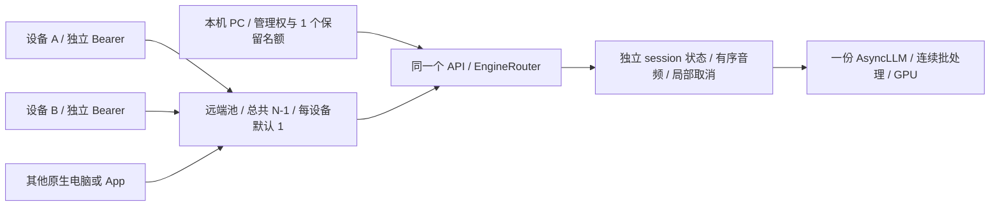

# R2T2 多路接入与容量研究

日期：2026-10-02。初始研究源码基线 `0f779d7`。初始阶段在 PC 录音期间只读取本机源码、已安装 vLLM 0.14.0 官方源码、模型配置、启动日志和既有实测，并做低开销资源观察。用户随后已授权执行探索，统一容量、设备配额与测量候选已在隔离分支 `codex/multi-stream-capacity` 实现并进入隔离 GPU 实验，**生产仍为 1 PC + 1 手机，未部署候选或扩容**。VPlus 与共享权重未改动。各次实验的配置、完成状态与数字以同目录[实验记录](multi-stream-experiment-2026-10-02.md)为准；本文保留研究阶段快照并补充源码证据边界。

## 结论

- **架构可以扩到多路**。继续使用一份 AsyncLLM、独立 session 状态、异步 RPC 和连续批处理；隔离候选已扩展准入、统一容量配置和每设备配额，尚未部署。
- **显存只决定能否容纳，不能单独决定速度**。实时容量还受音频编码、重复 prefill、解码、CPU 预处理、调度及其他 GPU 任务影响。
- 当前已验证并开放的生产容量是 **2 路**。研究阶段选择 4 路作为首个隔离目标；`candidate4-run1` 已执行，但约 46 秒触发 `CAPTURE_BUFFER_EXCEEDED`，`measurement_valid=false`，未形成完整四路速度基准。三路完成 90 秒，但积压 p95 为 2.06–2.22 秒且持续增加，未达实时和保持速度门槛；前后双路基线通过。600 秒双路完整性与实时通过，但后段积压增长约 0.25 秒，未通过 ≤0.1 秒的严格门槛，6–8 路、10/20 路没有新增容量承诺。
- “最多能连接多少”和“最多几路同时持续说话而几乎不变慢”是两个问题。应以后者决定开放名额，并保留处理同步开口、长窗口和同步收尾的余量。
- 推荐最终容量来自实测过的配置档位，资源监控在压力升高时限制新接入；**不按当前空闲显存或 GPU 百分比自动无限加路**。
- **目前不建议盲调线程、缓存或异步调度**。`generate_ms` 包含同步 CPU 音频特征、引擎调度/IPC 与 GPU 编码、prefill、解码，尚未分离其占比；异步调度已开启，完整音频项缓存不能复用逐步变化的窗口。

## 研究阶段资源快照与历史速度

初始研究阶段在已有用户听写期间做 20 次、约一秒间隔的只读观察，以下不代表隔离实验的资源状态：

| 项目 | 观测结果 | 能说明什么 |
| --- | --- | --- |
| RTX 4090 总显存 | 24564 MiB，约 24 GiB | 卡的物理预算 |
| 驱动报告 reserved | 517 MiB | total 与 used + free 不完全相等的原因 |
| 整卡 used | 9393–9483 MiB，约 9.17–9.26 GiB | 包含桌面、Voice 与其他进程 |
| 整卡 free | 14565–14655 MiB，约 14.22–14.31 GiB | 本轮采样时的余量，不是以后可独占的配额 |
| 整卡 GPU 活动率 | 平均 30%，范围 12–49% | 日常已有录音的短观察，非容量测试 |
| Voice 推理实例 | worker 386 MiB + EngineCore 6030 MiB，约 6.27 GiB | 当时实例包含权重、KV、encoder/运行时等 |
| 启动日志拆分 | 权重约 3.87 GiB；decode graph 约 0.03 GiB | 非全部进程显存；还需计 KV、临时激活、缓存等 |

观察数据保存在本机忽略文件 `work/multi-stream-research/gpu-observation.json`。资源值会随桌面和其他模型活动变化，不能把 free 当永久预留空间。

本次容量探索之前，已有 600 秒双路验收的关键数据：

| 指标 | PC | 手机 |
| --- | ---: | ---: |
| 步骤墙钟耗时 p50 / p95 / p99 | 130 / 172 / 207 ms | 145 / 179 / 211 ms |
| 客户端可见音频积压 p95 / p99 | 0.346 / 0.469 秒 | 0.361 / 0.490 秒 |
| 末三分之一相对首三分之一积压 p95 | -0.043 秒 | -0.049 秒 |
| finish → final | 0.275 秒 | 0.184 秒 |
| 发送额度等待 | 0 次 | 0 次 |

两路音频均完整处理、无串流、固定前缀保持，首末积压分位没有恶化。详细证据见 [验证记录](validation.md)。**没有匹配的单路基线，因此不能据此声称两路相对单路完全不降速。** 原验收的积压 p95 ≤2 秒是实时门槛，也不能当成“保持原速度”。

`inference_ms` 是获得会话锁后处理步骤的墙钟耗时，不是 CUDA 内核独占耗时；多路可以重叠，不能把它们相加后除以 160 ms 推容量。上述历史报告未按普通步/flush/final 分类，未保存完整 lag 时序，且 `queue_ms` 未转发进 WS 报告。当前隔离候选已补普通音频、flush、finish 分类、lag 时序、API/worker 排队与准备/生成/应用耗时；新基线与候选的完整证据见[实验记录](multi-stream-experiment-2026-10-02.md)。

历史双路测试整卡 GPU 平均 27.36%、峰值 51%，但同卡还有旧生产模型等进程；`nvidia-smi` 的活动率也不是理论算力利用率。不能用 `2 × 100 / 27.36` 推算可用路数。

## 研究基线的两路限制与候选实现

| 层 | 初始研究基线 | 当前隔离分支候选 |
| --- | --- | --- |
| API 准入 | `begin_mobile()` 只允许一个 mobile；状态写死总容量 2、mobile 1 | 已按 worker 实际容量 N 发布并准入，保留 PC 1、远端最多 N−1；在同一生命周期锁内原子登记 |
| 设备配额 | 靠全局单手机限制间接约束 | 已限制每个服务端认证 `device_id` 最多 1 路；`starting` 也占名额，轮换凭据不能绕过设备配额 |
| worker 会话 | `ConcurrentSessions` 是通用会话表 | 复用独立状态、顺序和取消；与 API 使用同一实际容量 |
| vLLM | `max_num_seqs=2`；环境变量允许 2–16 | 已统一 API 与 worker 容量配置，默认仍为 2、允许 2–16；20 路仍需调整应用校验 |
| 容量发布 | worker ready 返回 capacity，但 API 未保存它 | 已核对 worker 容量，失配加载失败；capabilities 反映实际容量与剩余名额 |
| KV cache | 显式固定 1 GiB | 已按实验档位配置预算；四路实验使用 2 GiB，不代表速度通过 |
| CUDA graph | 仅 `[1,2]`；预热也是两路 | 已默认捕获 `1..N`，按 N 路预热首步与 16 秒窗口；超过捕获范围仍按官方分派执行 |
| 调度/CPU | 每路有序；CPU 4 线程，部分准备在单事件循环同步执行 | 已补应用阶段计时；CPU 多模态预处理仍在 `generate_ms` 内，未作线程或调度调优 |

相关源码：[EngineRouter](../oneaxe_voice/engines.py)、[worker 配置与容量](../oneaxe_voice/concurrent_worker.py)、[RPC](../oneaxe_voice/worker_client.py)、[V1 接入](../oneaxe_voice/mobile_api.py)。

初始基线中，单改 worker 的 `ONEAXE_VOICE_STREAM_MAX_NUM_SEQS=4` 不能解除 API 单手机限制；当前候选已统一两端配置。接入名额扩大仍需独立实测推理速度，不能由准入实现完成推导容量通过。

## 显存如何计算

本地模型配置的 decoder 为 28 层、8 个 KV heads、head_dim=128，运行使用 FP16。单 token 的 KV 预算为：

```text
2（K 和 V）× 28 层 × 8 heads × 128 × 2 bytes
= 114688 bytes = 112 KiB / token

4096 token × 112 KiB = 448 MiB / 满上下文请求
```

这包含音频占位、文字 prompt 与输出的总上下文。CUDA 默认 16 token 一块，两路基线的 1 GiB KV 池共 585 块，即 **9360 token**。该配置启动日志也报告 `9360 tokens` 和 `Maximum concurrency for 4096 tokens per request: 2.29x`。安装版 vLLM 还保留一块作为 `null_block`，因此供请求使用最多 584 块、9344 token；满 4096 上下文请求的整数上限仍为两个。

**2.29x 是满上下文的 KV 容量比，不是实时识别路数，也不是 GPU 速度倍率。** 实际短请求可以更少占用；每个音频步骤结束后，vLLM 会释放该请求的 KV blocks。整轮 ASR session 保持，不等于整轮占着一份固定 KV 槽位。

以下仅计算“同一时刻 N 个请求都达到 4096 token”的 KV 下限，未计池内固定保留的 1.75 MiB `null_block`：

| 同时在途满上下文请求 | KV 合计 | 不包含的资源 |
| --- | ---: | --- |
| 2 | 0.875 GiB | 权重、encoder、激活、CUDA、graph、其他进程 |
| 4 | 1.75 GiB | 同上 |
| 8 | 3.50 GiB | 同上 |
| 10 | 4.375 GiB | 同上 |
| 20 | 8.75 GiB | 同上 |

新增会话不复制 3.87 GiB 权重。所以从这部分显存算术看，4090 不会天然卡在两路，甚至 20 个请求的 KV 也不等于需要 20 份模型。**但这张表不能证明 20 路总显存一定足够，更不能证明速度足够**：批量音频编码、临时工作区、缓存、graph 与桌面/VPlus 的峰值都尚未在这些规模下测量。

当前 `kv_cache_memory_bytes` 显式指定时，vLLM 对 KV 池使用该字节预算；`gpu_memory_utilization=.30` 不是整个进程严格最多 30% 显存的硬上限。加载前的 7 GiB 检查也只是当前配置的门槛，需要随更大配置重新验证。

## 保持速度真正需要解决什么

1. **持续计算量随说话路数增加。** 当前每路首次 320 ms，随后每 160 ms 一步，约每秒 6.25 次普通请求。4/8/10/20 路同时连续说话时，约为 25/50/62.5/125 次请求每秒，另加句尾收尾。
2. **每步不只生成两个 token。** 每步会重新提交完整累积音频窗口与文字前缀，窗口最长 16 秒、滚动 8 秒；先音频编码和 prefill，再少量解码。窗口变长时工作量会变化；多人同时 flush 的最多 64 token 收尾也会形成尖峰。
3. **当前缓存不能直接消除跨步骤重复计算。** prefix cache 关闭、CPU multimodal processor cache 为 0。安装版 vLLM 据此使用请求 ID 派生的多模态标识，音频特征不跨不同步骤请求复用。GPU encoder cache 仍存在，完成后释放引用，其数据可能留到被逐出；不能把它与 KV 或 CPU processor cache 混为一谈。
4. **批处理可能提高效率，但每路延迟仍有拐点。** AsyncLLM 连续批处理可摊薄一些开销；同时更多请求也会增加排队、encoder/prefill 工作量和 CPU 处理。若需调优，应先确认 `max_num_batched_tokens`、encoder 预算是否触限，以及实际 graph 分派，不能只把 `max_num_seqs` 调大。
5. **保留 PC 名额不等于保证 PC 算力优先。** 当前准入保护保证 PC 有位置，尚无跨服务 GPU 时间预留。VPlus 若开始重负载，要重新判断共享 GPU 的速度边界。

### 官方源码能确定的瓶颈边界

本机核对的版本为 `vllm==0.14.0`、`qwen-asr==0.0.6`、`transformers==4.57.6`。以下调用链和默认值来自这些安装版本；未用其他版本的行为替代当前证据。

`AsyncR2T2Decoder._generate()` 在调用适配器前记 `submitted_at`，等待最终输出后计算 `generate_ms`。应用侧 `prepare_ms` 只包含 PCM 转换、缓存与音频拼窗。vLLM 的 `AsyncLLM.add_request()` 在第一次提交 EngineCore 前，同步调用 `InputProcessor.process_inputs()`；该方法按 `OMP_NUM_THREADS` 设置 PyTorch 线程，并调用多模态预处理。因此 **CPU 音频特征与 tokenization 也计入 `generate_ms`**，会占用共享事件循环；不能用较小的 `prepare_ms` 排除 CPU 瓶颈。

Qwen3-ASR 后端继承官方 `Qwen3OmniMoeThinkerMultiModalProcessor` 的音频处理入口，调用本机 Qwen3ASRProcessor 的 WhisperFeatureExtractor。当前未传音频 `device`，Whisper 默认使用 CPU，执行 `torch.stft`、mel 矩阵乘法及 log-mel 归一化。提交的是每步变化的累积窗口，CPU 特征和 GPU audio tower 都需处理本步音频项。源码能确认这些工作发生，**不能据此确定其耗时占比或断言双路变慢主要由 CPU 导致**；GPU 音频编码、prefill、调度等待、IPC 和少量解码也在同一墙钟中。

现有证据不足以推荐以下调优 A/B：

- **CPU 线程数**：应用已固定 `OMP_NUM_THREADS=4` 和 `torch.set_num_threads(4)`，vLLM 输入预处理采用同样的 4 线程。官方 worker 默认 1 线程的说明是避免多进程造成 CPU 争用，没有证明本机当前 4 线程过度并行。尚无分离的 CPU 特征计时或争用实测，改为 1/8 线程的收益方向未知。
- **processor / encoder / prefix cache**：当前 processor cache 为 0、prefix cache 关闭，官方据此跳过音频内容哈希，以请求 ID 派生标识。processor 和 encoder cache 都按完整多模态项命中，不能复用不断追加、滚动窗口中的音频前缀。开启缓存会引入内容哈希与查表，当前语义下没有预期的跨步骤命中；固定 UUID 强行复用会取回旧音频特征，不满足保持识别算法的要求。
- **异步调度或扩大批次**：vLLM 0.14.0 在兼容配置下默认启用异步调度，基线与四路启动日志也已明确记录 `Asynchronous scheduling is enabled`。已有连续批处理，`max_num_seqs` 与 graph 已随候选档位设置。低整卡 GPU 活动率不能单独证明需要更大 batch，尚无 `max_num_batched_tokens` 或 encoder 预算触限的证据。

若以后需要继续定位，可在隔离实验使用 vLLM 官方内部 `enable_mm_processor_stats`，通过 `get_timing_stats_from_engine_client()` 获取逐请求的 HF processor、hashing、cache lookup、prompt update 与 total 耗时，再决定是否值得做线程 A/B。这是可用的诊断路径，尚未开启或实测；不改变 160 ms 步长、FP16、音频窗口或识别算法。

推荐先保持现有 160 ms 步长、窗口与精度，继续复用共享 AsyncLLM、每路最多一步在途、有界音频缓存和独立收发。根据测量补足 KV、目标档位 graph/预热与准入限制。CPU/encoder/prefill 确认成为瓶颈后，再分别处理；直接增大队列只会延迟暴露积压。

更大的音频块可能提升吞吐，但会改变出字延迟；FP8/量化、跨步骤 encoder 复用、优先级调度等还涉及兼容性、公平性或识别回归，不作为首轮保持原速度的默认手段。多个 API worker / 每路独立模型会重复占用资源，也不会自动解决同一张卡的算力限制。

## 多手机、远程电脑、App 如何接入

建议沿用现有受限设备 V1，将 mobile 在概念上作为“远端识别客户端”。手机、原生电脑客户端和其他 App 均可通过 Tailnet 的 HTTPS/WSS、独立设备 Bearer 接入；本机 PC 保留管理权。远程电脑不能使用本机管理员 token。



上述服务端容量与设备配额已在隔离候选实现，尚未部署。协议复用与客户端接入边界如下：

- 沿用能力查询、start 的实例/代次绑定、PCM16/16kHz/mono、累计样本额度、text/pending 与 seq。
- 已增加统一容量配置与每设备配额；`starting` 会话也占预留名额，防止并发 start 超售。
- capabilities 已反映实际总容量及剩余远端名额，`can_start` 同时检查当前凭据对应设备的限额；客户端数字显示仍需目标客户端验收。
- 超出接入预算返回 `CAPACITY_EXCEEDED`，不要让新会话在后台无界排队拖慢所有已接入者。
- 手机取消/断线仍只影响本路；PC 明确卸载/切换可终止所有远端会话，分别保留各自固定文字并提示原因。
- 当前旧桌面客户端限定 loopback，远程电脑需增加设备 V1 客户端适配。普通浏览器页面也不能直接接现接口：WS 携带 Origin 会被拒绝，若要网页接入需另设计相应鉴权与 Origin 策略。

模型控制、单路取消、TLS 和协议基础可以复用；无需先把 VPlus 迁移进来，也无需为每个设备复制模型。

## 怎样确定“最多几路且维持速度”

最大可开放值应是满足速度、正确性及资源余量的最大已验证 N，而不是显存除法的结果。至少区分三档：连接仍可保持、音频最终能处理完、持续实时且接近两路速度。本需求应采用最后一档。

初始研究提出的有界验证顺序如下；执行过程已到四路拐点，当前状态见下表和[实验记录](multi-stream-experiment-2026-10-02.md)：

1. **同条件基线**：在生产录音结束后的隔离环境，使用相同模型、材料、真实采集时钟、网络路径和其他 GPU 进程条件，分别测单路和两路。候选结束再补一轮两路，排除背景负载变化。第二份隔离模型本身也占显存，要单独记账。
2. **先验证 4 路，再决定是否继续**：先完成准入与设备限额的 CPU 回归，GPU 阶梯按 4→6→8 每档 90–120 秒。覆盖同步开口、16 秒窗口及同步 flush，按最差一路而非全局平均判断；触及门槛即停止加路，先定位唯一主要瓶颈。10/20 只在前面的趋势支持时才值得继续，避免无边界调参。
3. **通过档位做 10 分钟确认**：测试全部音频完整处理、无串流/前缀回退、取消与管理边界、持续文字、尾延迟和资源峰值。补普通步/flush/final 分类、worker/API 排队、逐分钟积压、KV/encoder 压力、GPU 与 CPU 指标；只保存计数/耗时/hash，不保存私人正文。

可先采用下列“接近原速度”的研究目标，再用重复基线确定自然波动：普通步 p95 增幅 ≤10%、p99 ≤20%，积压 p95 相比两路增加 ≤0.1 秒，末段相比前段增加 ≤0.1 秒；首次固定文字与 flush/final 也应在同样本中无明显退化。满足旧 2 秒积压门槛但超出上述目标，只能称“仍实时”，不能称“保持原速度”。

| 档位 | 当前结论 | 推荐动作 |
| --- | --- | --- |
| 2 路 | 前后基线通过；600 秒完整性/实时通过，但后段积压增长约 0.25 秒，未通过严格增长门槛 | 继续保持 1 PC + 1 手机，不承诺延迟恒定；详见实验记录 |
| 3 路 | 完整处理 90 秒，但积压 p95 为 2.06–2.22 秒；相比两批双路基线均未达速度门槛 | 不开放；不能把最终处理完等同持续实时 |
| 4 路 | 候选已实现；`candidate4-run1` 约 46 秒触发 `CAPTURE_BUFFER_EXCEEDED`，没有 OOM；`measurement_valid=false` | 整卡 GPU 平均 18.85%、峰值 32% 仅为部分运行观察；部分 p95 不作为完整基准或容量通过证据 |
| 6–8 路 | 没有本机实测 | 四路拐点已出现，暂停继续加路 |
| 10 / 20 路 | 技术上可以设计接入；保持速度与完整资源预算均未知 | 不给承诺，先看实测拐点 |

生产建议设置一个实测容量上限，并为桌面/临时激活保留显存余量；多路时用最近的积压与排队监控限制新接入。余量的具体字节值要结合实际峰值决定，无法防止独立 VPlus 或其他程序之后自行占用同卡资源。不能保证任意并行外部负载下速度完全不变。

## 官方依据与证据边界

初始研究阶段在线获取官方文档遇到 HTTP 403 / 连接重置；随后核对本机安装包 `vllm==0.14.0` 的官方源码和仓库固定 R2T2 版本。本次瓶颈核查继续使用本机安装源码，没有依据其他版本的默认值推断当前运行方式。以下版本链接用于复核，对应事实已从本地源码核查，未声称本次在线逐字比对成功：

- [vLLM 0.14.0 cache 配置](https://github.com/vllm-project/vllm/blob/v0.14.0/vllm/config/cache.py)：显式 KV 池字节数和利用率配置关系。
- [KV 结构](https://github.com/vllm-project/vllm/blob/v0.14.0/vllm/v1/kv_cache_interface.py)、[请求结束的 KV 回收](https://github.com/vllm-project/vllm/blob/v0.14.0/vllm/v1/core/sched/scheduler.py)：按层计算与请求释放。
- [KV 块池](https://github.com/vllm-project/vllm/blob/v0.14.0/vllm/v1/core/block_pool.py)：从池总块数中保留一个 `null_block`。
- [调度器配置](https://github.com/vllm-project/vllm/blob/v0.14.0/vllm/config/scheduler.py)：在途序列、batched tokens、encoder 预算与 chunked prefill。
- [AsyncLLM 请求入口](https://github.com/vllm-project/vllm/blob/v0.14.0/vllm/v1/engine/async_llm.py)、[输入预处理](https://github.com/vllm-project/vllm/blob/v0.14.0/vllm/v1/engine/input_processor.py)：同步 CPU 多模态处理在提交 EngineCore 前执行，线程数来自 `OMP_NUM_THREADS`。
- [Qwen3-Omni 多模态处理入口](https://github.com/vllm-project/vllm/blob/v0.14.0/vllm/model_executor/models/qwen3_omni_moe_thinker.py)：本机 Qwen3-ASR 后端继承的音频 padding 与 HF processor 调用。Qwen3ASRProcessor 的特征提取调用另核对本机 `qwen-asr==0.0.6` 安装源码；[Transformers 4.57.6 WhisperFeatureExtractor](https://github.com/huggingface/transformers/blob/v4.57.6/src/transformers/models/whisper/feature_extraction_whisper.py)给出 CPU 默认值与 STFT/log-mel 实现。
- [官方 worker 线程设置](https://github.com/vllm-project/vllm/blob/v0.14.0/vllm/v1/executor/multiproc_executor.py)：默认 1 线程用于降低多进程 CPU 争用，不等于本机音频特征提取的最优线程数。
- [异步调度默认判定](https://github.com/vllm-project/vllm/blob/v0.14.0/vllm/config/vllm.py)：兼容配置默认开启；本轮基线与四路启动日志亦已核对开启。
- [多模态处理与计时接口](https://github.com/vllm-project/vllm/blob/v0.14.0/vllm/multimodal/processing.py)、[observability 配置](https://github.com/vllm-project/vllm/blob/v0.14.0/vllm/config/observability.py)：完整音频项缓存与官方内部 processor 分阶段计时。诊断开关本轮未启用。
- [graph 分派](https://github.com/vllm-project/vllm/blob/v0.14.0/vllm/v1/cudagraph_dispatcher.py)：超过捕获大小不等于拒绝会话，而是选择非 graph 执行。
- [多模态输入标识](https://github.com/vllm-project/vllm/blob/v0.14.0/vllm/v1/engine/input_processor.py)、[encoder cache](https://github.com/vllm-project/vllm/blob/v0.14.0/vllm/v1/core/encoder_cache_manager.py)：三个缓存层及复用边界。
- [固定 R2T2 版本](https://github.com/netease-youdao/Confucius4-R2T2/tree/26d55a54ce5670cff9947a167d8ed95d569fd4d9)、[本项目异步适配](../oneaxe_voice/r2t2_async.py)：滚动音频窗口、每步请求与稳定前缀。

初始研究阶段只新增研究文档与资源观察。后续隔离候选已实现并开始多路 GPU 实验，尚未部署；三路边界验证、双路复测与 600 秒验证的最终状态和数字统一见[实验记录](multi-stream-experiment-2026-10-02.md)。本文的历史资源快照、官方源码分析与四路部分运行观察分别限定其证据范围，不继承为新增生产容量或保持速度的证明。
