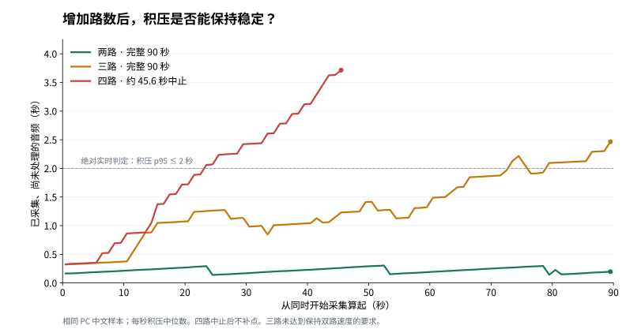
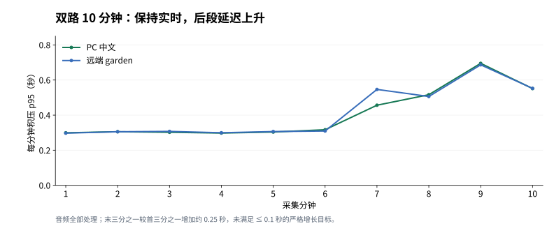

# 多路候选实现与隔离实验记录

日期：2026-10-02。用户已授权按[容量研究](multi-stream-capacity-research-2026-10-02.md)执行探索。候选代码在 `codex/multi-stream-capacity`，功能与测量基线为 `7a7670d`；正式工程仍为 `8aee122`，保持 1 PC + 1 手机，未部署本分支。

## 本轮结论

**生产继续保持 1 PC + 1 手机，本轮不部署扩容。** 三路完整转写但持续积压，四路因积压保护提前停止；未继续 6/8/10/20 路。前后两批双路短测满足相对速度门槛，双路 10 分钟完整性与绝对实时通过，但后段积压增加约 0.25 秒，未满足 ≤0.1 秒的严格增长目标。

因此当前证据支持继续使用既有两路，**没有支持开放三路以上的证据，也不支持“整个长测延迟恒定”的承诺**。这是当前 R2T2 实现、参数和受控负载的结果，不是 RTX 4090 的硬件最大路数。

## 已完成的候选

- 总容量由 `ONEAXE_VOICE_STREAM_MAX_NUM_SEQS` 配置，默认 2，范围 2–16。API 与 worker 核对实际容量，失配加载失败。
- 保留 PC 1 路，远端池 N−1；每个服务端认证设备最多 1 路。正在建立的会话计入名额，凭据轮换不能绕过配额。
- CUDA graph 默认捕获 1..N；按 N 路预热首步与 16 秒窗口。四路候选使用 2 GiB KV，保持 FP16、160 ms 步长和既有窗口。
- 新增普通音频、flush、finish 分类，以及 API 排队、RPC、worker 排队、准备、AsyncLLM 等待和结果应用耗时。指标不含录音或转写正文。
- 实验客户端按同一个真实时钟同步起跑，采集不等待识别，每 24 秒同时 flush，最终核对全部样本处理、稳定前缀、不同语料关键词及独立会话。

## CPU 与审查

完整 CPU 单元/组件测试 **232 项通过**，证据在本机忽略文件 `work/capacity/cpu-suite-final.log`。可提交实验 runner 的 **6 项 CPU 检查**另行通过；也验证了独立 systemd cgroup 的真实假进程回收。未把模拟推理结果当作 GPU 容量证据。

审查发现并修复三个影响实验可信度的问题：

1. 仅停止 API PID 不能保证清理另起进程组的 worker。改成每轮唯一的临时用户 systemd unit，`KillMode=control-group`、`TimeoutStopSec=5`；退出核对 unit 停止及原 cgroup 无进程。CPU 假进程覆盖清理期间才新建的 detached child，以及连续两次 SIGTERM。
2. 首字和收尾原先只有记录，没有参与“保持速度”的判断。现在与普通步骤和积压一起作为门槛。
3. 文字快照合并可能丢弃性能样本。现在核对 audio 事件数等于发送帧数、flush 等于发送次数、finish 等于 1；缺样时测量无效，不计算通过的速度结论。

## 实验材料与顺序

四种受控音频为既有 10 秒中文课程测试片段，以及 CPU Flite 合成的 garden、planet、music 英语语料。音频和凭据留在忽略目录，报告只存 hash、计数、耗时和关键词检查布尔值。

PC 与远端身份都连接专用 loopback `18098`；这轮研究比较服务端容量，不替代 Android 真机或跨网验收。生产 Voice 模型保持驻留且空闲，VPlus 不改动；测试实例的额外显存独立记账。

计划先用两路配置测单路 A、双路 AB、双路 CD，每组 90 秒；再加载四路配置测 ABCD，并重复双路基线排除背景波动。按匹配音频而非所有通道混合平均值比较，取最差一路：

| 指标 | 研究门槛 |
| --- | --- |
| 普通步骤 p95 / p99 | 相对双路基线增幅 ≤10% / ≤20% |
| 音频积压 p95 | 相对双路增加 ≤0.1 秒 |
| 末三分之一相对首三分之一积压 p95 | 增加 ≤0.1 秒 |
| 首次固定文字 | 基线 + max(0.3 秒, 基线的 20%) |
| flush p95 / finish | 基线 + max(0.1 秒, 基线的 20%) |

这些是实验判定目标，不是产品 SLA。正确性、绝对实时与相对速度分别报告；只有全部满足才继续 6→8 路。遇到速度拐点停止加路，对通过档位做 10 分钟确认。

## GPU 结果与判定

同一 RTX 4090、FP16、16 秒窗口、8 秒滚动、160 ms 后续步长，所有会话 ready 后同步开始真实采集；每 24 秒同步 flush。实验额外加载一份模型，生产模型空闲驻留。没有改变识别规则来换取吞吐。

### 首轮完整基线

`baseline2-run3` 的单路、双路 AB、双路 CD 各 90 秒均完整通过；每路发送并处理 1,440,000 样本，563 个 audio、3 个 flush、1 个 finish 事件齐全。各路固定前缀、独有关键词及相互隔离检查通过。

| 来源 | 普通步 p95 / p99（ms） | 积压 p95（秒） | 末段积压增长（秒） | 首次固定文字（秒） | finish（秒） |
| --- | ---: | ---: | ---: | ---: | ---: |
| 单路中文 | 95.90 / 109.25 | 0.245 | -0.0001 | 4.081 | 0.096 |
| 双路 AB 中文 | 148.65 / 162.22 | 0.296 | 0.0046 | 4.138 | 0.202 |
| 双路 AB garden | 151.15 / 161.87 | 0.296 | 0.0058 | 1.107 | 0.206 |
| 双路 CD planet | 151.79 / 164.23 | 0.296 | 0.0029 | 1.257 | 0.212 |
| 双路 CD music | 150.32 / 162.85 | 0.297 | 0.0064 | 1.088 | 0.218 |

首次固定文字由音频内容、开头静音和稳定前缀共同决定，不是纯 GPU 推理耗时。90 秒只有 3 次 flush，现有分位算法的 p95 会取中间样本，不能代表可靠尾延迟；报告同时保留全部 flush 值和最大值。

### 四路在约 45.6 秒触发积压保护

`candidate4-run1` 使用 4 路容量、2 GiB KV 和 1/2/3/4 的 decode graph；ready 与多路预热成功，KV 启动日志为 18,720 tokens。开始转写后，积压持续增大：按 10 秒区间的中位数约为 0.35 → 1.21 → 2.07–2.23 → 2.62–2.78 → 3.46–3.62 秒，末次观测为 3.80–3.96 秒。

远端通道此时已采集 45.44 秒音频，部分通道只送出 43.52 秒、处理 41.60 秒；客户端和服务端各积压约 1.92 秒。下一帧令客户端缓存超过 32,000 样本，触发 `CAPTURE_BUFFER_EXCEEDED`，实验按设计终止。缓冲限制没有放宽。

以下仅为**中止前诊断**，不构成完整 90 秒容量或正确性基准：

- 普通 RPC 中位约 170 ms，超过每路 160 ms 输入间隔；API 排队 p95 约 2 秒，worker 会话锁排队 p95 不到 0.5 ms。
- 普通步 p95 为 189–198 ms；只完成一次同步 flush，四路分别为 2.3469 / 2.3665 / 2.3605 / 2.3784 秒。
- `measurement_valid=false`，未到 finish，也未覆盖最后三分之一；不能把缺失的 finish、末段数据或按预定 90 秒封尾的文字间隔当作完整测量。
- 已观测区间的固定前缀及关键词检查通过；整轮正确性未通过，不能声称四路转写已验收。

本轮四路不满足持续实时，更不满足保持双路速度。按停止规则，不再测试 6/8/10/20 路。为缩小两路与四路之间的边界，只补一档三路，保持其余识别参数不变。

### 三路完整转写，但不满足实时与保持速度

`candidate3-run2` 使用 3 路容量、1.5 GiB KV 与 1/2/3 的 decode graph，完成 90 秒。三路均为 1,440,000 样本、563/3/1 事件，全部处理且 final 完整；关键词与固定前缀检查通过。`measurement_valid=true`、`correctness.passed=true`，但 `absolute_realtime.passed=false`。

| 来源 | 普通步 p95 / p99（ms） | 积压 p95（秒） | 末段积压增长（秒） | 三次 flush（秒） | finish（秒） |
| --- | ---: | ---: | ---: | --- | ---: |
| 中文 | 174.35 / 200.30 | 2.216 | 1.036 | 1.4133 / 1.5118 / 2.2938 | 1.907 |
| garden | 172.82 / 193.86 | 2.057 | 0.876 | 1.3997 / 1.3348 / 2.1495 | 2.031 |
| planet | 183.18 / 212.50 | 2.058 | 0.876 | 1.3959 / 1.3401 / 2.1497 | 2.019 |

前 60 秒积压 p95 约 1.26–1.31 秒，之后 30 秒升为 2.14–2.30 秒。首次固定文字为 4.170 / 1.280 / 1.463 秒，接近基线，但后续积压、flush 和收尾退化，因此不能用“首字差不多”判定容量通过。

相对前置双路基线，最差一路普通步 p95 / p99 增幅为 20.7% / 29.4%，积压 p95 增加 1.920 秒，均超过研究门槛；完整比较文件为 `compare3-before.json`。相对后置基线也不通过：最差 p95 / p99 增幅 21.2% / 29.4%，积压 p95 增加 1.913 秒（`compare3-after.json`）。两批基线分别比较，没有混合挑选。



图中是同一 PC 中文样本的每秒积压中位数；四路中止后没有插值或补点。原始采样与每路检查见证据汇总。

### 双路后置基线与 10 分钟确认

`baseline2-repeat` 的 AB/CD 各 90 秒完整通过；同为每路 1,440,000 样本及 563/3/1 事件，无关键词串流或前缀回退。相对前置同音频双路，两组都满足保持速度门槛（`compare2-repeat-ab.json`、`compare2-repeat-cd.json`）。

| 来源 | 普通步 p95 / p99（ms） | 积压 p95（秒） | 末段积压增长（秒） | 三次 flush（秒） | finish（秒） |
| --- | ---: | ---: | ---: | --- | ---: |
| AB 中文 | 157.33 / 169.41 | 0.303 | 0.0280 | 0.2834 / 0.4017 / 0.2857 | 0.196 |
| AB garden | 160.59 / 174.67 | 0.320 | 0.0447 | 0.2774 / 0.2857 / 0.2856 | 0.206 |
| CD planet | 151.15 / 164.21 | 0.299 | 0.0056 | 0.2976 / 0.2917 / 0.2981 | 0.207 |
| CD music | 151.49 / 159.99 | 0.301 | 0.0087 | 0.2966 / 0.2952 / 0.2918 | 0.214 |

前后基线的最差一路 p95 变化 +6.24%、p99 +7.91%、积压 p95 +0.024 秒。这个范围的背景波动不足以解释三路新增约 1.9 秒积压或四路中止。前置 AB 中文三次 flush 为 0.2923 / 0.3999 / 0.3053 秒；其余前置双路最大 flush 为 0.2955–0.3057 秒，完整原值见 JSON 汇总。

同一后置两路实例完成 AB 600 秒，`passed=true`、`measurement_valid=true`。每路 9,600,000 样本全部处理，3,750 个 audio、24 个 flush、1 个 finish 事件齐全；固定前缀与独有关键词检查通过，worker/模型代次保持，无发送额度等待，客户端音频缓冲峰值仅 2,560 样本（160 ms）。

| 指标 | PC 中文 | 远端 garden |
| --- | ---: | ---: |
| 普通步 p95 / p99 | 167.81 / 204.22 ms | 170.27 / 205.73 ms |
| 积压 p95 / p99 | 0.4217 / 0.6236 秒 | 0.4301 / 0.6723 秒 |
| 首次固定文字 | 4.1434 秒 | 1.0878 秒 |
| 24 次 flush p95 / 最大值 | 0.5781 / 0.7681 秒 | 0.5628 / 0.7749 秒 |
| finish | 0.3165 秒 | 0.3197 秒 |
| 末段相对前段积压 p95 增量 | **0.2526 秒** | **0.2462 秒** |

**通过的是完整性与绝对实时，严格增长门槛未通过。** benchmark 的 `passed` 只组合正确性与绝对实时，不能替代更严格的研究速度检查。前六分钟逐分钟积压 p95 约 0.30–0.32 秒，之后升高，第九分钟约 0.69 秒、第十分钟约 0.55 秒；没有发展为三/四路那样的缓冲耗尽，但也不能写成“后段没有变慢”。本轮无法确定这部分变化来自背景负载、运行时调度或其他因素，未继续反复重测挑选结果。



长测整卡 GPU 活动率平均 19.82%、峰值 49%，实验推理实例峰值仍为 6,414 MiB，整卡峰值 16,698 MiB。600 秒与 90 秒时长不同，不计算成同条件相对速度通过。全部原始 flush 值和逐分钟数据见证据汇总。

## 资源与瓶颈边界

首轮双路实验实例峰值为 worker 386 MiB + EngineCore 6,028 MiB，合计 6,414 MiB（6.264 GiB）；三路为 386 + 6,634 = 7,020 MiB（6.855 GiB）；四路为 386 + 7,324 = 7,710 MiB（7.529 GiB）。每多一路不复制一份模型，增量主要来自扩大 KV、graph 和临时工作区，不能把实测增量当作每路固定预算。

四路期间整卡显存峰值 17,436 MiB，包含生产实例、实验实例和桌面；平均 GPU 活动率 18.85%、峰值 32%，没有显存不足触发证据。两路 AB/CD 整卡活动率平均约 15.6% / 15.4%。`nvidia-smi` 活动率表示采样区间内 GPU 忙碌比例，不能直接换算计算单元利用率或支持路数。

`generate_ms` 包含 AsyncLLM 的 CPU 特征处理、调度、IPC 和 GPU，不是纯 GPU 时间。官方链路会在引擎提交前同步计算 CPU STFT/log-mel；当前证据没有分离各部分占比，不能认定唯一瓶颈。异步调度已经开启，完整音频项缓存不能复用每步变化的音频前缀；盲目改线程或缓存缺乏成功依据，本轮不继续试参。依据与可选后续诊断见[研究文档](multi-stream-capacity-research-2026-10-02.md)。一次事后 CPU 观察未捕获有效样本，未用于 CPU 性能结论。

## 失败记录与证据边界

- `baseline2`、`baseline2-run2`：生产录音保护在实验加载前拒绝启动。
- `baseline2-run1`：加载期间生产恢复录音，保护停止实验，未进入音频基准。
- `candidate3-run1`：模型已 ready，但测试 manifest 当时只允许 1/2/4/6/8 路，客户端以 `UNSUPPORTED_STREAM_COUNT` 拒绝，未发送音频。允许列表增加 3 后，相关 11 项 CPU 检查通过，以新标签重跑。这不是三路模型性能失败。
- 所有尝试保留各自文件，未覆盖失败。四路的提前终止属于容量失败，不与前述保护/工具拒绝混淆。

本机详细报告在忽略目录 `work/capacity/`，不提交音频、凭据、转写或私有路径。[精简可提交证据](evidence/capacity-2026-10-02.json)记录原报告文件名与 SHA-256、计数、耗时、布尔检查、配置及资源峰值。

planet 在 CD 双路基线中使用 PC 身份，在三/四路中使用远端身份；音频 hash、起点和模型相同，但角色不同，不能声称客户端身份完全一致。这些 loopback 测量也不替代 Android 真机、跨网或 VPlus 同时重负载验收。

## 复现入口与运行边界

[run_capacity_profile.py](../tests/run_capacity_profile.py) 只读监测显式指定的生产 runtime，在专用端口 `18098` 启动唯一的临时用户 systemd unit；`KillMode=control-group` 会回收 API、worker 与 EngineCore。实验 runtime 和工作目录必须与生产分开，凭据按设备独立准备。生产恢复录音、状态不可读或收到退出信号都会清理实验，不调整生产服务。

例如在准备好独立 manifest 后，以新标签运行：

```bash
.venv/bin/python tests/run_capacity_profile.py \
  --live-runtime "$HOME/tools/oneaxe-voice/runtime" \
  --label new-baseline --capacity 2 --kv-gib 1 \
  pair-ab:90 pair-cd:90 pair-ab:600
```

比较使用 [e2e_capacity.py](../tests/e2e_capacity.py) 的两个 `--compare-baseline` 分别传 AB/CD，再传同为 90 秒的 `--compare-candidate`。前、后两批基线分别生成比较，不把四份一起传入后误以为算法自动选取最佳匹配；也不把 600 秒长测直接冒充 90 秒同条件比较。必须同时核对 `passed` 与 `measurement_valid`。

## 最终运行状态

每轮临时 systemd unit 均停止，报告中的 `remaining_owned_pids=[]`；最后一轮的 worker/EngineCore 已从 GPU 列表消失。正式 Voice 保持 `ready / r2t2 / cuda:0 / max_sessions=2`，桌面 idle；API PID `313597`、worker `313684`、EngineCore `317181` 与测试前一致。VPlus PID `7301`、启动时间 `2026-09-30 23:20:01 CST` 保持，健康接口为 200。未部署候选、重启正式服务或修改共享权重，用户可以恢复 F8 听写。
