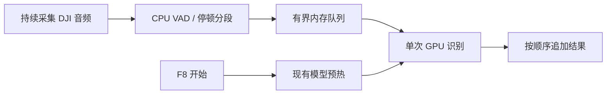

# VAD 分段与持续输出

## 行为

按 F8 开启一轮持续听写，同时发起模型预热。麦克风保持打开；检测到约 700 ms 无人声后，将上一段送入现有 Qwen3-ASR API。识别完成立即追加到原输入位置，录音继续进行。再次按 F8 停止采集，把尾段补进队列，等待已经录制的各段依次输出。

这里是按语音片段输出完整识别结果，不是逐 token 的模型原生流式解码。已经输出的文字不回退改写，口头语和重复表达按 ASR 原文保留。本次不做口头语整理。

## 怎样判断停顿

采用 `webrtcvad-wheels==2.0.14` 所包含的 WebRTC VAD，在 CPU 上分类。它分析多个频带的声学特征，通过统计模型判断每个 20 ms PCM16 单声道帧是否像语音，不只是判断响度。

默认流程：

1. 音频以 16 kHz 采集，按 20 ms（320 个采样点）分帧。
2. 很低的电平先过滤（默认 -60 dBFS），其余交给 WebRTC 模式 2 分类。
3. 最近五帧中有两帧被判断为语音，则进入说话状态。保留此前最多 240 ms 的音频，减少漏首字。
4. 连续 700 ms 没有被判为语音，形成一个片段。送入 ASR 的音频保留约 160 ms 尾部上下文，其余停顿不上传。
5. 不足约 120 ms 的零碎人声判定通常忽略，减少敲击声等误触发；强制分段后的短尾音另行保留。

VAD 本身存在状态延续，因此从人耳听到话音结束到分段，可能比配置的 700 ms 略长。背景音乐、电视人声、强噪声、很轻的说话仍可能误判；参数应按实际 DJI 电平调整。不会因此加载额外 GPU 模型。

## 并发和延迟



预热与采集并行。识别任务串行消费片段，确保第二段不会先于第一段输出。第一次冷启动若尚未完成，录下的片段先排队；预热不是消除模型加载时间，而是把加载提前到开始说话时。模型仍沿用 120 秒空闲卸载规则，长时间不说话后，下一段可能再次等待模型加载。

每段最长默认 15 秒，连续不停顿时会切段。强制切段可能发生在词句中间，局部识别或标点可能受影响；本版不引入重叠音频的猜测性去重，以免误删重复表达。每轮最长 900 秒，达到上限后停止采集并完成剩余识别。

默认最多排队 8 段。队列满时立即关闭麦克风，保留刚形成的最后一段并等待队列处理，然后结束本轮；会显示积压提示。不会无限堆积音频或悄悄跳过已经形成的片段。只有明确 `429` 的请求会重试，其他 API 错误会停止本轮，已完成文字保存在本机。

## 输入与取消

每段输入前检查原窗口及 X11 焦点。发现变化后，本轮进入只复制模式，后续片段累积为整轮文本放入剪贴板；即使切回原窗口，也不自动补打，防止重复或输入错位置。开始新一轮 F8 才重新选择目标。相同窗口内的标签页或光标变化未必改变 X11 焦点，这是当前检测的限制。

自动输入时剪贴板通常是最近一段，完整内容始终可在 `runtime/last-transcript.txt` 找到。只复制模式的剪贴板是截至当前的整轮文本。

`./bin/oneaxe-voice cancel` 停止采集和未完成的桌面任务。已经输入的片段保留；已经发送给 X11 的一次粘贴无法撤回，取消会等待它结束并阻止后续片段。已经开始的服务端 GPU 请求可能继续完成，但不会重新输入取消后的结果。

## 配置与结果

本机配置仍在 `runtime/desktop.json`，每轮开始读取：

| 配置 | 默认值 | 范围或作用 |
| --- | ---: | --- |
| `pause_ms` | 700 | 300–2000，连续无人声阈值，毫秒 |
| `segment_seconds` | 15 | 3–30，单段时长上限 |
| `max_session_seconds` | 900 | 10–3600，一轮录音上限 |
| `vad_mode` | 2 | 0–3，越高越倾向把可疑帧判为非语音 |
| `vad_min_dbfs` | -60 | -100–0，极低电平过滤 |
| `queue_size` | 8 | 1–16，等待识别的片段上限 |
| `source` | null | 唯一 DJI 自动选择，或完整的输入设备名 |
| `clipboard_only` | false | 全轮仅复制，不模拟粘贴 |
| `shortcut` | F8 | 通知标签；真实键位由 desktop-setup 管理 |

上一版的 `max_seconds` 和 `silence_dbfs` 不再控制持续听写；新参数分别拆为会话、片段时长和 VAD 判定。调低 `pause_ms` 会更快出字，也更容易把思考中的短暂停顿切开。

`desktop-status` 中 `capture_active` 表示仍在录音，`recognizing` 表示正处理一个片段，`warming` 表示等待预热，`segments_done` 和 `segments_pasted` 表示识别及自动输入计数。`state=finishing` 表示录音已停止，剩余结果还在处理。

`runtime/last-transcript.txt` 保存最后一轮有结果的完整文字；`runtime/last-session.json` 保存同轮逐段 ASR 原文、次序、切分原因（pause/limit/stop）、时长和请求 ID。两者权限为 0600，原子更新，未纳入 Git。原始录音只在有界内存与 ASR 的临时文件中存在，不在这些结果文件里保存。

## 安装与回退

独立环境中安装新增的小型 VAD 依赖，然后更新自己的服务：

```bash
.venv/bin/python -m pip install webrtcvad-wheels==2.0.14
systemctl --user restart oneaxe-voice.service oneaxe-voice-desktop.service
```

重启前应结束当前听写。本轮没有修改 VPlus、其环境或权重。上一版可用提交为 `9cc57b7`；当前沿用 GitHub 的 `master` 主分支。
